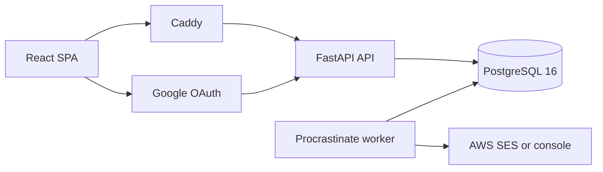

# Placement Portal architecture

This document describes the current implementation. Product semantics live in
[`BEHAVIOR.md`](BEHAVIOR.md); exact data and command contracts live in
[`LLD.md`](LLD.md).

## System shape

Placement Portal is a PostgreSQL-backed modular monolith with a React browser
client and a separate background worker.



PostgreSQL is the only authoritative state store. It contains business data,
sessions, idempotency records, application events, audit history, notification
state, and the Procrastinate queue. The API, worker, and edge are replaceable
processes.

The production Compose definition also includes migrations, backup tooling, an
alert relay, and health checks. Monitoring configuration for Prometheus,
Grafana, Loki, Alloy, and cAdvisor is under `ops/observability`. Deployment
procedures and environment-specific runbooks are intentionally private.

## Why a modular monolith

All domains share one transaction boundary. Accepting an offer can update an
offer and application, cascade into applications in other jobs or cycles,
append timeline and audit history, and enqueue notifications atomically. A
service split would turn that operation into a distributed transaction without
providing a useful ownership boundary for this deployment.

Code is nevertheless organized into vertical slices under
`backend/app/modules/`:

- identity and profiles;
- taxonomies, cycles, memberships, and companies;
- jobs, applications, rounds, and attendance;
- portal offers and external offers;
- discipline, interventions, and overrides;
- notifications, analytics, exports, and administration.

Shared machinery lives in `backend/app/core/`. Pure business policy lives in
`backend/app/domain/`.

## Application assembly

`backend/app/main.py` constructs the application by:

1. creating the async SQLAlchemy engine;
2. building the command and screen registry;
3. constructing authorization, session, and executor services;
4. installing OAuth, session, CSRF, and error middleware;
5. generating command and screen routes from the registry; and
6. exposing health, readiness, OAuth, `/me`, and parse-only upload routes.

Most API routes are generated:

```text
POST /api/v1/commands/{command_name}
GET  /api/v1/screens/{screen_id}
```

Multipart upload endpoints parse CSV/XLSX input into normalized rows but do not
write business state. Their resulting JSON is submitted to ordinary commands.

## The command model

Every business mutation is registered as a command with:

- a Pydantic input and output model;
- an actor class and authorization scope;
- a loader that reads and locks authoritative state;
- a pure decider;
- the override domains it may consult; and
- rate-limit, bulk, and specification metadata.

A decider returns either a `Rejection` or a `Plan`:

```python
Plan(
    state_ops=[...],  # ordered inserts, updates, and deletes
    events=[...],     # append-only application history
    deferred=[...],   # transactional outbox jobs
    audit={...},      # audit-log detail
    summary={...},    # preview and execution response
)
```

Deciders do not perform I/O. This makes decisions deterministic and lets dry-run
previews execute exactly the same logic as confirmation.

## The write path

`backend/app/core/executor.py` is the sole business-transaction interpreter:

1. check route-level actor authorization;
2. open one transaction;
3. reserve or replay the idempotency key;
4. load state, acquiring locks for execution;
5. check authorization again against loaded scope;
6. resolve applicable overrides declared by the command;
7. call the pure decider;
8. return immediately for a dry run;
9. apply state operations in order;
10. append application events and audit history;
11. insert deferred jobs using the current database session; and
12. store the idempotent result and commit once.

No route, screen, task, or domain function commits business data. Static tests
reject transaction entry points outside the sanctioned files.

### Atomic side effects

Procrastinate jobs are inserted through its SQL defer function on the command's
current PostgreSQL session. Therefore a notification, reminder, export build,
or checker task is durable if and only if the business transaction commits.

Deferred handlers are idempotent and never carry authoritative cascades. A
status transition, cap release, restoration, membership exit, or acceptance
cascade belongs in `state_ops` in the originating transaction.

### Idempotency and bulk work

Single commands can reserve an idempotency key and replay the stored result.
Bulk operations process bounded chunks, each with a deterministic derived key,
and return an explicit result for every selected or pasted row. A failed later
chunk can be retried without repeating earlier chunks.

## Authorization

Stored user roles are `student` and `admin`. Coordinator capability is derived
from `cycle_coordinators`, allowing a coordinator to remain a student in other
contexts.

Commands are authorized twice: first from actor and request scope, then from the
cycle/job/application resolved by the loader. Staff screen handlers similarly
resolve path resources and verify cycle assignment. Hiding navigation is a user
experience choice, not an authorization boundary.

Archived cycles are centrally read-only for cycle-scoped commands, with
read-only analytics and export access retained.

## Concurrency and invariants

The loader takes locks before a decision judges mutable facts. Important
patterns include:

- enrollment-level serialization for accepted-offer and placed-state changes;
- application/job locks for status transitions;
- compare-and-set fields such as expected status, attendance, and round;
- deterministic lock ordering in bulk operations; and
- partial unique/check constraints as database backstops.

The consistency checker independently derives critical invariants and records
repairable findings. It does not silently rewrite business state.

## Events and audit

`application_events` records the business timeline of an application. Every
status change emits an event, and non-status facts such as attendance and venue
assignment emit events where they are needed to reconstruct the process.

`audit_log` records who invoked a command, its subject, and structured details.
Both histories carry monotonic append-order identities and are append-only for
the runtime database role. Migration/owner credentials remain operationally
sensitive because they can change grants.

Application status and current round are sanctioned maintained projections for
workflow reads. Placed state, cap usage, funnel metrics, and compensation
statistics are derived from source rows rather than stored as independent
truth.

## Eligibility and policy

Eligibility rules are typed boolean trees evaluated by pure functions. The same
populated facts and rule evaluator feed job cards and the binding apply command,
preventing the UI from inventing a different verdict.

Cycle policy is resolved from explicit cycle values and kind-specific defaults,
with provenance returned to staff screens. Null cap values mean uncapped rather
than zero.

Application profile snapshots preserve what eligibility saw at submission.
Later profile corrections affect future decisions but do not retroactively move
existing applications.

## Overrides

Overrides are standing, audited allow/deny decisions over nine domains. Six
legal target combinations form the precedence order:

```text
cycle
job
enrollment
cycle + enrollment
job + enrollment
application
```

A row applies only when every target it names matches the command context. More
specific targets win; at equal precedence deny wins, then creation order and ID
make the result deterministic.

Commands declare the domains they consult. A static contract test compares that
declaration to gate usage so an enforcement path cannot accidentally bypass its
overrides. Domain/scope legality rejects grants that could never affect their
target.

See [`OVERRIDES.md`](OVERRIDES.md) for end-to-end coverage and remaining product
policy gaps.

## Offers and placed state

Portal offers and external offers feed one set of derivations. Accepted,
unterminated placement offers establish global placement state. Internship state
is scoped according to cycle kind and attachment policy.

Acceptance is planned centrally. It:

1. checks response deadline and accepted-offer constraints;
2. accepts the selected offer;
3. declines competing open offers in the cascade scope;
4. auto-withdraws competing in-flight applications;
5. appends causal events carrying credited override IDs; and
6. enqueues notifications in the same transaction.

External acceptance uses the same cascade planner. Attaching an already accepted
external offer separately evaluates the target cycle's cap and can create the
required active membership.

Termination is explicit and can restore applications affected by the original
acceptance. Re-extension always creates a fresh offer row, preserving declined
or terminated history.

## Notifications and scheduled work

Notification templates and delivery attempts are stored in PostgreSQL. The
worker consumes transactional outbox jobs, renders templates from supplied
context, and uses either a safe console backend or AWS SES.

Delivery is at least once. A deterministic notification identity suppresses
ordinary retries after a recorded success, but an external-provider success
followed by a database failure can still produce a duplicate message.

Scheduled offer expiry and reminders revalidate authoritative state at fire
time. They never assume that the state present when scheduled still holds.

## Screen-shaped reads

The backend registers aggregate read models around browser screens instead of
exposing a generic CRUD API. A screen payload includes the rows, lookup values,
counts, exact reasons, current IDs, and action permissions that page needs.

The React client uses TanStack Query and a generated OpenAPI command client.
`frontend/src/api/screenDeps.ts` maps command success to affected screen caches.
Authorization and policy remain server decisions; the client only renders the
returned permissions.

Adding a screen requires backend execution coverage, frontend route coverage,
captured payload rendering, and invalidation wiring. Adding a command expands
exhaustive registry, authorization, route, preview, and dependency tests.

## Analytics and exports

Analytics is read-only and uses canonical cohort/derivation functions shared
across dashboard, report, and export surfaces. This prevents two screens from
assigning different meanings to placed, offered, registered, or compensation.

Exports are requested through commands and built asynchronously. The output is
generated data, not authoritative state. Outcome tags produce a separately
labeled seeking-only denominator; they do not rewrite the headline placement
rate or remove accepted offers.

## Deployment and recovery machinery

The public repository contains executable deployment components but no
institution-specific operating procedure:

- production API, worker, edge, migration, alert-relay, and backup images;
- WAL archive, physical base-backup, logical-dump, retention, and restore tools;
- a restore drill that re-proves append-only database grants;
- Prometheus alert and Grafana dashboard validation; and
- production preflight, image build, migration, health, and status targets.

Operators must maintain a private runbook covering their hosts, credentials,
DNS, OAuth application, email provider, backup remote, monitoring endpoints,
recovery objectives, and incident responsibilities.

## Test ratchets

`make check` includes:

- Ruff and Pyright;
- forbidden-pattern checks for architecture invariants;
- Compose, Caddy, Prometheus, dashboard, and backup checks;
- migration upgrade and schema-drift checks;
- exhaustive backend tests;
- generated-client freshness;
- a production frontend build; and
- frontend unit/component tests.

`make e2e` rebuilds and runs critical, responsive, and full-lifecycle browser
flows. Browser behavior is claimed only from this rebuilt path, not from a
possibly stale manually started image.

CI additionally scans secrets, dependencies, source with CodeQL, and production
container images.

## Known boundaries

The application intentionally has no uploaded-file storage, recruiter accounts,
password login, high-availability database, or exactly-once external email.
Several rare policy cases remain unsupported or conditional; they are listed in
[`OVERRIDES.md`](OVERRIDES.md) rather than hidden behind ad hoc database edits.

The governing mental model is:

> Load and lock the truth, decide purely, commit every authoritative consequence
> once, derive rather than duplicate, and fail closed when policy is unknown.
